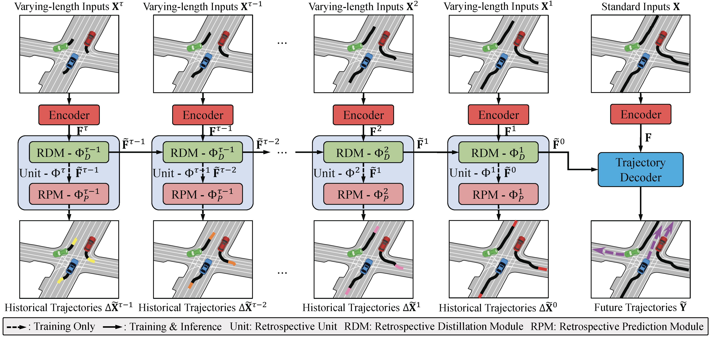
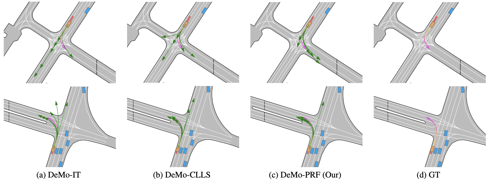

# Recover to Predict: Progressive Retrospective Learning for Variable-Length Trajectory Prediction

> [**Recover to Predict: Progressive Retrospective Learning for Variable-Length Trajectory Prediction**](https://arxiv.org/abs/2410.05982)  
> **Hao Zhou, Lu Qi, Xiangtai Li, Jie Zhang, Yi Liu, Xu Yang, Mingyu Fan, Fei Luo**  
> **CVPR 2026**

## 🚗 Abstract
Trajectory prediction is critical for autonomous driving, enabling safe and efficient planning in dense, dynamic traffic. Most existing methods optimize prediction accuracy under fixed-length observations. However, real-world driving often yields variable-length, incomplete observations, posing a challenge to these methods. A common strategy is to directly map features from incomplete observations to those from complete ones. This one-shot mapping, however, struggles to learn accurate representations for short trajectories due to significant information gaps. To address this issue, we propose a Progressive Retrospective Framework (PRF), which gradually aligns features from incomplete observations with those from complete ones via a cascade of retrospective units. Each unit consists of a Retrospective Distillation Module (RDM) and a Retrospective Prediction Module (RPM), where RDM distills features and RPM recovers previous timesteps using the distilled features. Moreover, we propose a Rolling-Start Training Strategy (RSTS) that enhances data efficiency during PRF training. PRF is plug-and-play with existing methods. Extensive experiments on datasets Argoverse 2 and Argoverse 1 demonstrate the effectiveness of PRF.

## 🎞️ Pipeline
<div align="center">
  
</div><br/>

## 🛠️ Get started

### Set up a new virtual environment
```
conda create -n PRF python=3.10
conda activate PRF
```

### Install dependency packpages
```
pip install torch==2.1.1 torchvision==0.16.1 torchaudio==2.1.1 --index-url https://download.pytorch.org/whl/cu118
pip install -r ./requirements.txt
pip install av2==0.2.1
```

### Install Mamba
- We follow the settings outlined in [VideoMamba](https://github.com/OpenGVLab/VideoMamba).
```
git clone git@github.com:OpenGVLab/VideoMamba.git
cd VideoMamba
pip install -e causal-conv1d
pip install -e mamba
```

### Some packages may be useful
```
pip install tensorboard
pip install torch-scatter -f https://data.pyg.org/whl/torch-2.1.1+cu118.html
pip install protobuf==3.20.3
```

## 🕹️ Prepare the data
### Setup [Argoverse 2 Motion Forecasting Dataset](https://www.argoverse.org/av2.html)
```
data_root
    ├── train
    │   ├── 0000b0f9-99f9-4a1f-a231-5be9e4c523f7
    │   ├── 0000b6ab-e100-4f6b-aee8-b520b57c0530
    │   ├── ...
    ├── val
    │   ├── 00010486-9a07-48ae-b493-cf4545855937
    │   ├── 00062a32-8d6d-4449-9948-6fedac67bfcd
    │   ├── ...
    ├── test
    │   ├── 0000b329-f890-4c2b-93f2-7e2413d4ca5b
    │   ├── 0008c251-e9b0-4708-b762-b15cb6effc27
    │   ├── ...
```

### Preprocess
```
python preprocess_av2.py --data_root=/path/to/data_root -p
```

### The structure of the dataset after processing
```
└── data
    └── PRF_processed
        ├── train
        ├── val
        └── test
```

## 🔥 Training and testing
```
# Train
python train.py 

# Val, remember to change the checkpoint to your own in eval.py
# Note: In `conf/datamodule/av2.yaml`, set `val_squence_start`
# to [0`, 10, 20, 30, 40] (line 18) to validate with observation
# length [50, 40, 30, 20, 10], respectively.
python eval.py

# Test for submission
python eval.py gpus=1 test=true
```

### Qualitative Results
<div align="center">
  
</div><br/>


## ⭐ Results and checkpoints
- We provide the model: `PRF` for [PRF](https://arxiv.org/abs/2410.05982) trained on the Argoverse 2 dataset.

- Validation results on variable-length observations:

| Models | 10Ts | 20Ts | 20Ts | 40Ts | 50Ts |  
| :- | :-: | :-: | :-: | :-: | :-: |  
| TaPD |  0.617/1.183  |  0.603/1.155  |  0.598/1.143  |  0.599/1.145  | 0.596/1.142 |  

- Test results on standard length observations:  

| Models | b-mFDE<sub>6</sub> | mADE<sub>6</sub> | mFDE<sub>6</sub> | MR<sub>6</sub> | mADE<sub>1</sub> | mFDE<sub>6</sub> |  
| :- | :-: | :-: | :-: | :-: | :-: | :-: |  
| TaPD |  1.81  |  0.60  |  1.14  |  0.13  | 1.49 | 3.72 |  
